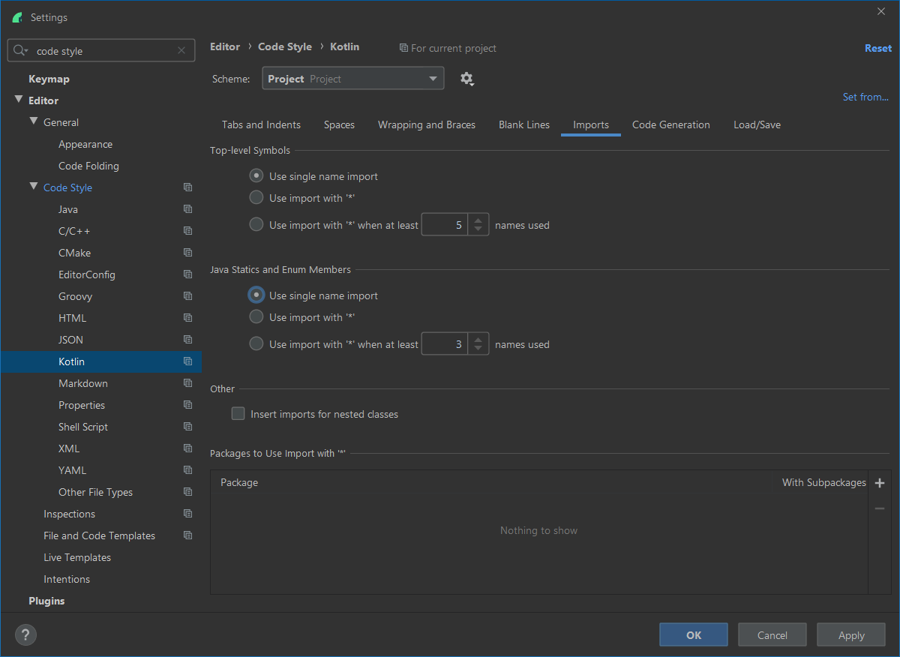
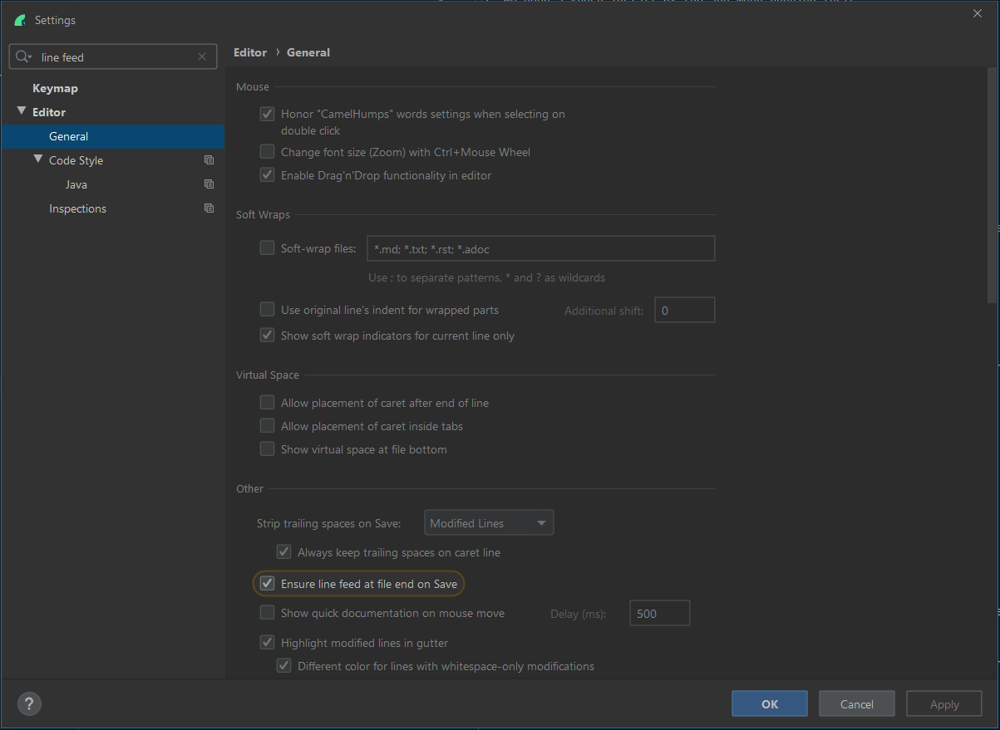

# Sonar Co-Locate for Android

## Running tests

1. Device setup

    Make sure all animations are turned off on the device (not an emulator) that is running the tests.
    https://developer.android.com/training/testing/espresso/setup#set-up-environment

1. Before pushing code run -
    ```bash
    ./gradlew build connectedAndroidTest
    ```

   They are the default tasks, so you can also just run -
   ```bash
   ./gradlew
   ```

**NOTE**
 * DO NOT UNDER ANY CIRCUMSTANCE skip running the tests before pushing.
 * DO NOT UNDER ANY CIRCUMSTANCE disable tests.
 * DO NOT UNDER ANY CIRCUMSTANCE push code to master that knowingly breaks the test suite.

## Code formatting with KTLint

KTLint has been added to the build and will automatically run when you run the build.
It is attached to the `check` step of the build.

The official Kotlin style guide recommends slightly different configuration from the default
Android Studio setup.

1. The continuation indent should be set to 4

    

1. Imports should *never* use wildcards

    

1. Files should end with a new line character.
    
    

## Play Store

1. Make sure you have configured the following properties in `~/.gradle/gradle.properties`

  ```properties
  SIGNING_KEY_ALIAS=<keystore alias>
  SIGNING_KEY_STORE=<path/to/keystore>
  SIGNING_KEY_STORE_PASSWORD=<keystore password>
  SIGNING_KEY_PASSWORD=<key password>
  PLAY_SERVICES_PUBLISH=<path/to/play-services.json>
  ```

2. To publish new release in `internal test track`, run following command in project root directory:

   ```bash
   ./gradlew publish -Pplay-enabled
   ```
**NOTE**
  * The build number will be set automatically. you don't need to change or commit it to git
